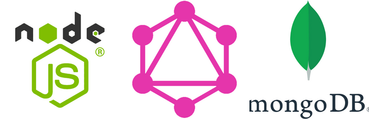

# GraphQl Event App Back



## 🖋️ Description

This is a backend for a simple concert administration app built in order to investigate the use of  **GraphQL**.

The api connects to a MongoDB database and provides CRUD methods for concerts, artists and music genres. 

The frontend for the app can be found here:  

🔗[Graphql Event App Frontend](https://github.com/kbastamow/GraphQL-event-app-front)

## ⚒️ Tech

- **NodeJS**
- **Express**
- **GraphQL**
- **MongoDB Atlas**
- **Mongoose**
- **GraphQL Playground**

## 📦 Database

The database consists of 3 documents: Concert, Artist and Genre.


## 🎮 GraphQL Playground

GraphQL Playground can be used to test queries and mutations before a client side exists at `<backendURL>/playground`.  
Examples of queries:


Get all events: 
```
query {   <- query keyword is optional
  events {  <- endpoint name
    id       <- what we want returned
    name
    description
    price
    image
    date
    artists {  <- "joins"
      name
    }
  }
}
```
Get event by id: 
```
{ 
  event(id: "1") {  ← args
    id,
    name,
    description,
    price,
    date,
  }
}
```
Create event: 
```
mutation {      ← necessary keyword
  addEvent(
	name: "Pop concert",   ← data to add
	description: "Lorem ipsum", 
	date: "2023-11-22T20:45:00", 
	price: 10) {
    	id      ← data to return
    	name
    	description
    	date
    	price
  }
}
```
## 🌟 Acknowledgements

A very useful GraphQL full stack tutorial by [Brad Traversy](https://github.com/bradtraversy/) can be found on 
[Youtube](https://www.youtube.com/watch?v=BcLNfwF04Kw).


## Author

- kbastamow